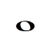
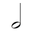
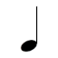
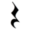
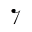
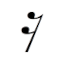
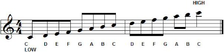

# Brief Introduction to Rhythms

To understand how Rhythm Engine works, let see a little bit of Music Notation theory.

**Rhythm** it is a sequence of sounds at regular intervals. Rhythms can have repetition and dynamic alternation with strong and weak beats.

### Notes and Rests

These regular intervals can be interpreted as **notes**. Each note has an symbol that represents the time value and their relative length in relation to each other. The following table shows the most commons notes names (American US terminology) and their respective beat values: 

| Symbol                                  | Name           | Value    |
| --------------------------------------- | -------------- | -------- |
|      | Whole note     | 4 beats  |
|       | Half note      | 2 beats  |
|    | Quarter note   | 1 beat   |
|     | Eighth note    | 1/2 beat |
|  | Sixteenth note | 1/4 beat |

We also have the **rests** that is sign of the absence of sound - intervals od silence. Each rest symbols have note value for length indicating how long the silence should last. We represent rest as:

| Symbol                                  | Name           | Value    |
| --------------------------------------- | -------------- | -------- |
|      | Whole rest     | 4 beats  |
|       | Half rest      | 2 beats  |
|    | Quarter rest   | 1 beat   |
|     | Eighth rest    | 1/2 beat |
|  | Sixteenth rest | 1/4 beat |

Notes and rests values are subdivision of the longer note in half. For example, the quarter note is half of the value of half note. The below diagram shows how the note subdivision works: at every level, the division of note values will happen by halves.


### Tempo

Another important concept is the **tempo** (_time_ in Italian) that refers to the the speed at which a piece of music will be played. This is often measured in _beats per minute_ (aka. BPM). A fast tempo will have high BPM value. 

Suppose an imaginary song where its tempo is `80` BPM. So we can say that if pulse is equal to `0.75` seconds. Pulse is calculated by dividing 60 by the BPM of the song. Example:

```
60 / bpm = pulse in seconds

60 / 80  = 0.75s
```
The song tempo applies to the musical notes duration. For example, the tempo of a song is 40 BPM, the length of each would be:

- whole note (4 beats) = 2.66 seconds = `4 * (40 / 60)`
- half note (2 beats) = 1.33 seconds = `2 * (40 / 60)`
- quarter note (1 beat) = 0.66 seconds = `1 * (40 / 60)`
- eighth note (1/2 beat) = 0.33 seconds = `(1 / 2) * (40 / 60)`

Some BPM values and multiplier in seconds (float):

| BPM | Seconds |
| --- | ------- |
| 240 | 0.25    |
| 180 | 0.33    |
| 120 | 0.5     |
| 80  | 0.75    |
| 60  | 1       |
| 40  | 1.5     |
| 20  | 2       | 

### Pitch

And the last concept is **pitch**. The pitch defines the note between high and low tones. The image below demonstrates how low and high notes are differentiated into a musical pentagram on the scale of G major. The higher up the stave, the higher the note sounds.



In the current version of RhythmosEngine it does not enables to simulate the sound of instrument in different tones. In order to cover these aspects, the tool adopted an class called `AudioReference`. 

### Sources

- [Rhythmic Values and Simple Metre - Music Theory Blog](https://musictheorysite.wordpress.com/blog/page/2/)
- [Tempo - DaCapoAlCoda](https://www.dacapoalcoda.com/tempo)
- [Rest - Wikipedia](https://en.wikipedia.org/wiki/Rest_(music))


