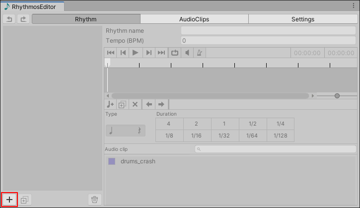
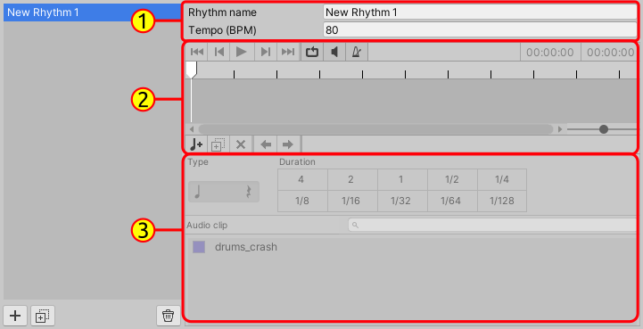
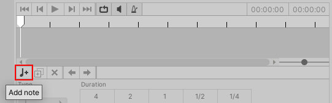
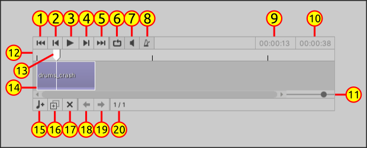
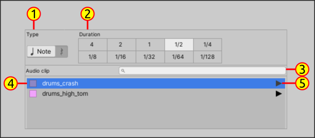

# Rhythmos Editor - Creating Rhythms

The main feature of Rhythmos Editor is the rhythm editor in located in the first tab: **Rhythms**.

On the left there is a scroll view that lists all rhythms that you have created. While in the left there is the rhythm track editor. To create a rhythm follow the below steps:

1. Click in the bottom button with plus sign `+`

Your new rhythm will be added to list of rhythms. We're ready to compose rhythms! Before that let see how the rhythm creator is organized:

   - (1) **Rhythm Settings**: set name and tempo of rhythm
   - (2) **Timeline**: displays player options, rhythm timeline and note creation options
   - (3) **Note configuration**: When a note is selected you can whether set a note or rest, set the beat value and the `AudioReference`.

Initially the options in the **Timeline** and **Note Settings** are unavailable because the rhythm is empty. With this overview let's continue in our composition.

2. Click on in "quarter note and plus sign" icon in the **Timeline** to append a new note to the rhythm.

3. You will see a new note in the time-line. The general description of the elements of the **Timeline**:

**Playback options**:
- (1) Go to start of timeline
- (2) Go previous note
- (3) Play/Stop rhythm playback
- (4) Go to next note
- (5) Go to end of timeline
- (6) Enable/Disable loop
- (7) Mute/Unmute rhythm playback
- (8) Enable/disable metronome playback
- (9) Current playback position. Format: `Minutes:Seconds:Milliseconds`.
- (10) Rhythm total duration

**Timeline**
- (11) Zoom slider
- (12) Playhead area
- (13) Current playhead position
- (14) Representation of a note on the timeline

**Note edition options**
- (15) Add new note
- (16) Duplicate selected note
- (17) Remove selected note
- (18) Move selected note to left
- (19) Move selected note to right
- (20) Current selected no index / total of notes

4.  When you select a note, you can configure the **Note Settings**.

- (1) If the selected element is note or rest. When the element is a rest it means an interval of silence in rhythm (no sound).
- (2) Defines the _beat value_ of the selected element - duration of the element
- (3) `AudioClip` search bar by name
- (4) `AudioReference` item
- (5) Preview AudioClip
