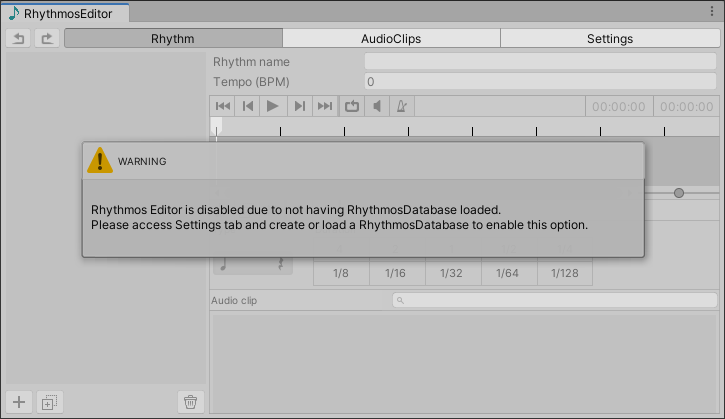
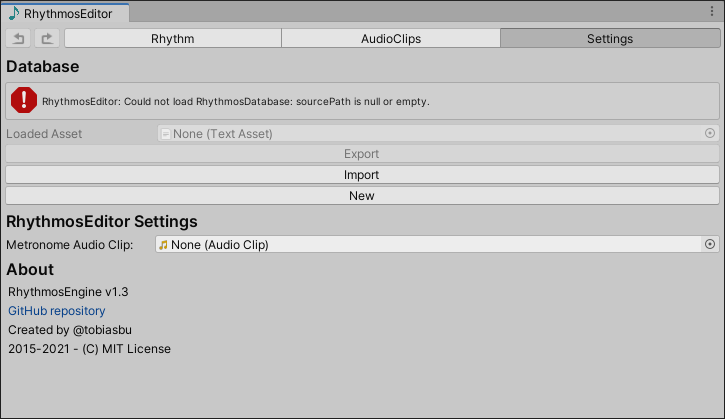

# Rhythmos Editor - Getting Started

The Rhythmos Editor is an extension to facilitate creation of rhythms. To open it go to the **Tools** > **Rhythmos Editor** at the top bar of the Unity.

1. When you open for the first time, the following screen is showed:

    You will see a message saying:
    
    > _"Rhythmos Editor is disabled due to not having RhythmosDatabase loaded. Please access Settings tab and create or load RhythmosDatabase to enable this options."_

    That's  means  that RhythmosEditor don't have loaded any RhythmosDatabase file. 
    
    Go to **Settings** tab

2. In the **Settings** tab, under **Database** section, you'll see a  status message and two buttons enabled. 

- **New**: create a new XML Rhythmos database file. Clicking in this option will open a new window to select where you want to store the RhythmosDatabase. Make sure to create inside `Assets` folder of your project.

- **Import**: imports a Rhythmos database XML file. Click in this option you have already created one Rhythmos database XML file.

3. Other available options:

- If you have loaded a database you can make a copy using the option **Export**.
- The **Metronome AudioClip** is a optional sound effect play every beat. This can be used you to assist during rhythm creation.

4. Done! You are ready to create your own rhythms!
