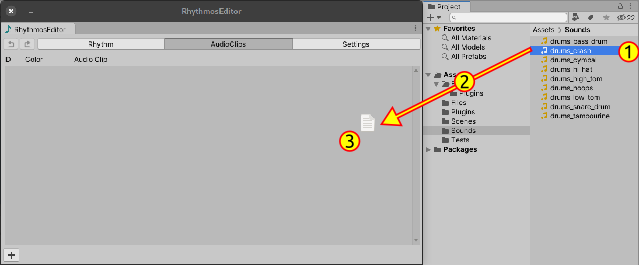
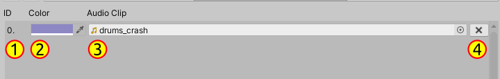

# Rhythmos Editor - Importing AudioClips

In order to actually have sounds in our rhythms, we need to import audio clips into RhythmosDatabase.

1. Go to **AudioClips** tab

2. You have two ways to add `AudioReference`:

- Click in the bottom button with plus sign `+` and manually select the desired sound effect in AudioClip field

- Or by drag and drop `AudioClips` to Rhythmos Editor window:

  1. Select your files in Project explorer
  2. Drag to RhythmosEditor window
  3. Drop the files inside the scroll view area
    

3. After create and import, it will be added the new AudioReference item to the list. Each number 

  1. The `AudioReference` index
  2. Custom color. Colors serve to distinguish notes when you are editing rhythms.
  3. AudioClip field. If this field is not set and a Rhythm is using will simple not be played. Tip: select short sounds only.
  4. Remove this `AudioReference`. Be careful. Removing one item in the list can damage the rhythms 
