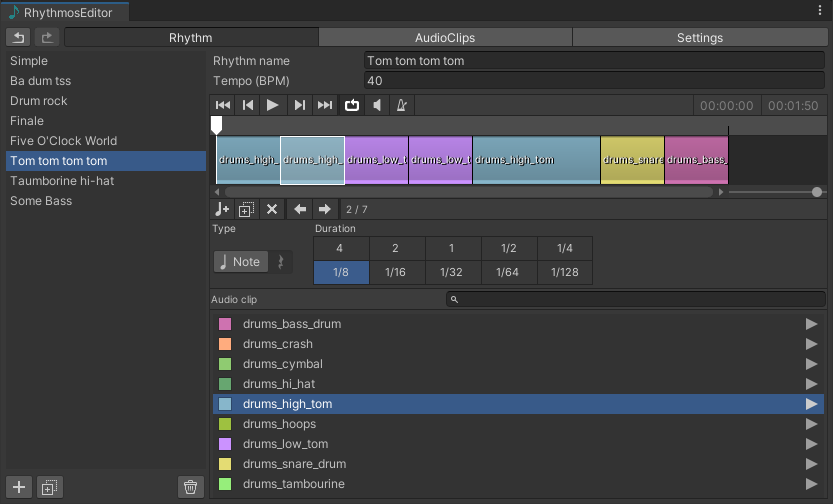

# Welcome 

**Rhythmos Engine** is an extension for [Unity 3D](https://unity.com/) to create rhythms for musical games or apps, based on musical notation. 

From greek _rhythmos_ means "any regular recurring motion, symmetry".

## Articles

To get start please access the following links:

- [Brief Introduction to Rhythms](/articles/brief-introduction-rhythms.html)
- [Downloads and Installation guide](/articles/downloads-installation-guide.html)
- [Rhythmos Editor Manual](/articles/rhythmos-editor.html)
- [API Documentation](/api/RhythmosEngine.html)

## Support

If you have question, suggestions or issues please contact the e-mail tobiasbulrich@gmail.com or access the project [GitHub repository](https://github.com/tobiasbu/rhythmos-engine).

## Note

This documentation is dedicated to the `v1.3` and above versions. 

If you are using an old version please refer to the [old documentation page](https://drive.google.com/file/d/0B0spb4kkmET9UUVqUjBmSk5BeVk/view?resourcekey=0-vNGxZvq7XXLEdIYhXZGn1w).

